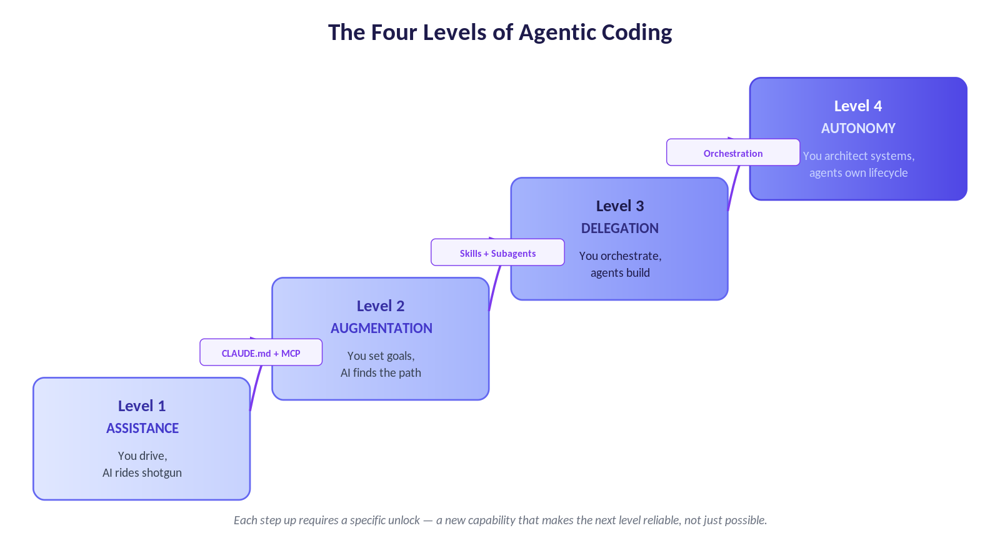
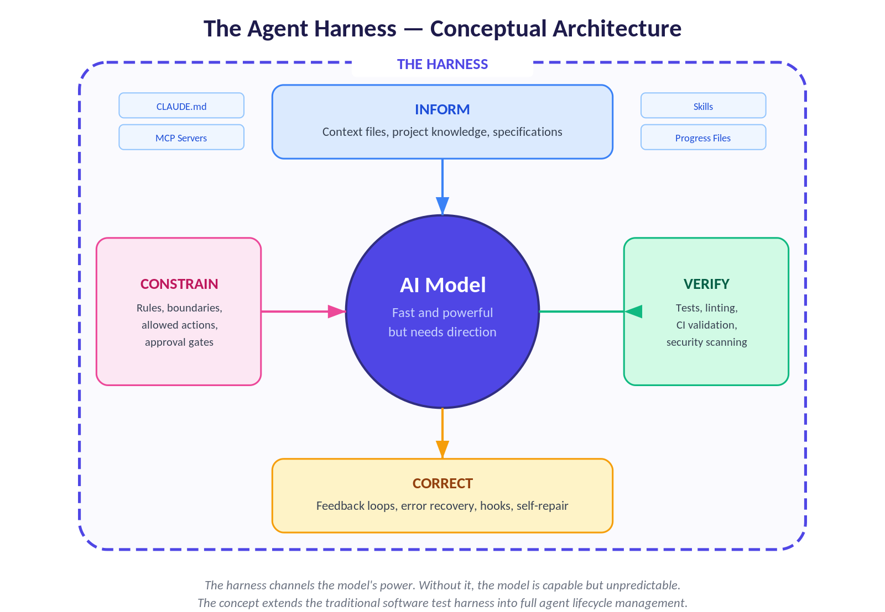
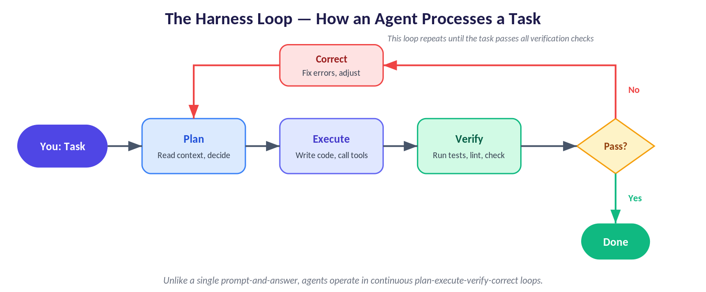
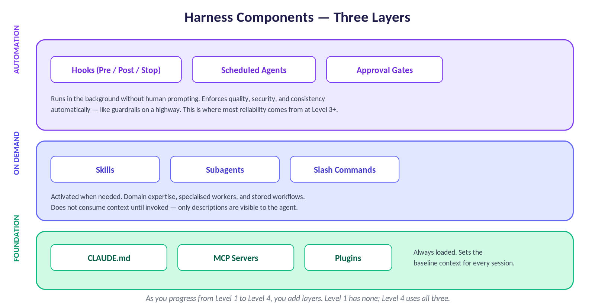
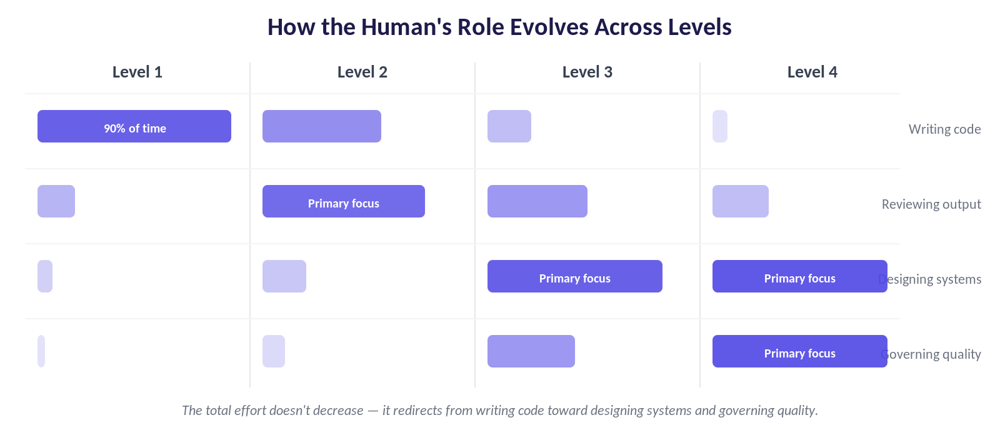

# From Prompting to Orchestration: A Developer's Field Guide to Agentic Coding

**Part 1: Research Briefing — Harnesses, Skills, Tools & Plugins**

*Leon Hailstones | March 2026*

---

## Executive Summary

Agentic coding — where AI agents autonomously plan, execute, and iterate on software development tasks — has crossed from experimental frontier to production reality. As of 2026, 92% of US developers use AI tools daily, and the industry has shifted decisively from AI as a coding assistant to AI as a full development collaborator.

This briefing covers three interconnected topics that developers need to understand together: (1) the four levels of agentic coding progression, (2) the agent harness — the system of scaffolding, context files, tools, and feedback loops that makes agents reliable, and (3) the expanding ecosystem of skills, plugins, MCP servers, and subagents that allows teams to dramatically automate and extend their development workflows.

---

## What Is Agentic Coding?

Agentic coding is a software development approach where AI agents autonomously handle coding tasks — planning, executing, and iterating with minimal human intervention. Unlike traditional AI coding assistants that offer single suggestions, agentic coding agents operate in continuous feedback loops.

**The key distinction: you are not writing code — you are orchestrating agents who write it.**

The evolution of AI development tools has followed a clear trajectory:

- Autocomplete and snippet suggestions (2022–2023)
- Repo-aware chat assistants with multi-file context (2024)
- Autonomous agents executing multi-step tasks with tool use (2025)
- Multi-agent systems with harnesses building entire applications (2026)

> **KEY INSIGHT**
>
> As Andrej Karpathy put it in December 2025: "There's a new programmable layer of abstraction to master involving agents, subagents, their prompts, contexts, memory, modes, permissions, tools, plugins, skills, hooks, MCP, LSP, slash commands, workflows, and IDE integrations." The horse has been handed around — but it comes with no manual.

---

## Understanding the Agent Harness

The harness is the single most important concept to understand if you want to get reliable, high-quality output from coding agents. The term has deep roots in software engineering: test harnesses have been standard practice since the late 1980s (Kent Beck's SUnit, Perl's TAP protocol), providing the scaffolding that wraps and validates code under test. The agentic coding community — led by OpenAI's Codex team, LangChain, and others — extended this concept to wrap entire AI agents, not just code. The metaphor also draws from horse tack: a harness channels a powerful but unpredictable animal in the right direction. The AI model is the horse — fast and powerful, but it does not know where to go on its own.

> **DEFINITION**
>
> A harness is the system of context files, constraints, tools, feedback loops, and lifecycle management that surrounds an AI agent. It determines what the agent can see, what it can do, and whether its outputs are correct.

LangChain proved that the harness matters more than the model: their coding agent improved from 52.8% to 66.5% on Terminal Bench 2.0 — jumping from Top 30 to Top 5 — by changing nothing about the underlying model. Only the harness changed.

### The Four Functions of a Harness

| Function | What It Does |
|----------|-------------|
| **Constrain** | Defines architectural boundaries, dependency rules, and what the agent is allowed to do |
| **Inform** | Context engineering — ensures the agent has the right information (and only that) at the right time |
| **Verify** | Testing, linting, CI validation — mechanically enforces what good output looks like |
| **Correct** | Feedback loops and self-repair mechanisms that respond when the agent goes wrong |

### Harness Architecture: Scaffolding vs. Runtime

Harnesses have two phases:

- **Scaffolding** — assembles the agent before the first prompt: system prompt, tool schemas, context files (CLAUDE.md / AGENTS.md), skill registry, and subagent definitions.
- **Runtime (the harness loop)** — orchestrates tool dispatch, context management, safety enforcement, and feedback injection while the agent is running.

### Context Engineering: The Core Discipline

Context engineering — a term popularised by Andrej Karpathy in mid-2025 — is the practice of curating what goes into the agent's limited context window. It is the fundamental skill that separates engineers who get great agent output from those who get hallucinations and drift.

- Context window limits are real — frontier models range from 200K (Claude Opus 4.5) to 400K tokens (GPT-5.2). Performance degrades as the window fills.
- The critical rule: from the agent's perspective, anything it cannot access in-context does not exist. Knowledge in Google Docs, Slack threads, or people's heads is invisible.
- Suppress noise aggressively — successful teams feed agents only errors, not 4,000 lines of passing test output that floods context and causes task drift.
- Use progressive disclosure — don't load all context upfront. Tell the agent how to find information so it fetches it only when needed.

---

## Harness Components in Detail

### 1. CLAUDE.md / AGENTS.md — The Foundation

*(Note: CLAUDE.md is used by Claude Code; AGENTS.md is OpenAI Codex's equivalent. Both serve the same purpose but for different tools.)*

These files are the highest-leverage configuration point in any harness. They are injected into every session automatically and tell the agent about your project's conventions, commands, and architecture.

> **BEST PRACTICE**
>
> Keep CLAUDE.md under 60–200 lines. It should contain only universally applicable context — project structure, always-run commands, coding conventions. Everything else belongs in Skills or agent-guide docs that load on demand.

A well-structured CLAUDE.md contains three sections:

- **Why** — a 1–3 sentence description of what the project is and why it matters.
- **What** — a project map: directory structure, key services, how components relate.
- **How** — always-apply rules: which tools to use for deps, linting, testing; what never to hardcode.

Under each section, use progressive disclosure: point to deeper guide files rather than embedding all context inline.

### 2. Skills — Reusable Domain Expertise

Skills are filesystem-based, reusable resources stored as SKILL.md files in a dedicated directory. They give agents domain-specific expertise — workflows, context, and best practices — without permanently occupying the context window.

| Aspect | Detail |
|--------|--------|
| **Format** | SKILL.md file with YAML frontmatter (name + description) and body instructions |
| **Storage** | ~/.claude/skills/ (global) or project/.claude/skills/ (project-scoped) |
| **Key feature** | Progressive disclosure: files referenced in the skill are loaded on-demand, not upfront |
| **Scripts** | Skills can bundle executable scripts — the script code never enters the context, only its output |
| **Selection** | Claude uses the description field to auto-select the right skill from 100+ available |
| **Cross-platform** | Works across Claude Code, Claude.ai, and Claude Desktop — define once, use everywhere |

Examples of skills teams build: BigQuery analysis patterns (with table schemas and filtering rules), API contract documentation, migration workflows, code review checklists, and architectural pattern enforcement.

> **EXAMPLE**
>
> A "form-filling" skill bundles a FORMS.md schema reference and a validate_form.py script. When Claude needs to fill a form, it reads SKILL.md for instructions, loads FORMS.md only if needed, and runs validate_form.py — receiving only the output ("Validation passed") rather than the entire script code.

### 3. MCP Servers — Connecting Agents to the World

Model Context Protocol (MCP) servers are the primary mechanism for extending agent capabilities beyond file I/O and bash commands. When you plug an MCP server into your agent, its available tools, descriptions, and argument schemas are injected into the context.

| MCP Server Category | Examples |
|---------------------|----------|
| **Project management** | Linear, Jira, Asana — agents can fetch, create, and update issues directly |
| **Observability** | Sentry, Datadog — agents can query logs (LogQL), metrics (PromQL), and traces |
| **Version control** | GitHub — create PRs, read commit history, manage issues, trigger workflows |
| **Databases** | BigQuery, PostgreSQL, Supabase — agents can query schemas and run migrations |
| **Design & docs** | Figma, Confluence, Notion — agents can read designs and update documentation |
| **Browser automation** | Playwright, Chrome DevTools Protocol — agents can drive UIs and capture screenshots |
| **Communication** | Slack, Gmail — agents can post updates and read context from conversations |
| **Custom CLIs** | Wrap narrow API subsets in a small CLI for context-efficient tool calls |

> **BEST PRACTICE**
>
> Don't blindly install every available MCP server. The full Linear MCP server may expose 40+ tools; a custom CLI wrapper exposing only the 6 commands you actually use is far more context-efficient and less likely to confuse the agent.

### 4. Plugins — Marketplace Extensions

Plugins add skills, tools, and integrations to your agent with no configuration required. In Claude Code, running /plugin opens a marketplace where you can browse and install community-built extensions. Plugins follow the same SKILL.md structure but are distributed and versioned independently.

- **Security note**: treat plugin installation like installing software — audit the SKILL.md, scripts, and any external URLs before enabling in production environments.
- **Conflict risk**: a generic "React best practices" plugin may recommend patterns that contradict your existing architecture. Always test plugins against your codebase conventions.

### 5. Subagents — Specialised Parallel Workers

Subagents are specialized agents defined in .claude/agents/ that the top-level orchestrator can spawn to handle isolated tasks. They run in their own context with their own allowed tool set, preventing context pollution in the main conversation.

| Subagent Type | Typical Responsibilities & Tools |
|---------------|----------------------------------|
| **security-reviewer** | Reviews code for injection vulnerabilities, auth flaws, secrets; uses Read, Grep, Glob, Bash; runs as Claude Opus |
| **test-writer** | Generates unit and integration tests for modified files; runs the test suite and reports failures |
| **documentation-agent** | Verifies docs match current code; updates README, API docs, and changelogs after PRs land |
| **qa-agent** | Boots the application, drives the UI via Playwright or Chrome DevTools Protocol, validates visual correctness |
| **migration-agent** | Handles database migrations — reads schema, generates migration files, validates rollback paths |
| **dependency-auditor** | Scans for circular dependencies, outdated packages, and unused imports on a scheduled basis |

### 6. Hooks — Event-Driven Automation

Hooks are user-defined handlers that fire outside the main agentic loop on specific events. They enable true automation without consuming context window space.

- **Pre-tool hooks**: run a linter or security scanner before the agent executes a file write
- **Post-tool hooks**: run a formatter after every code edit so the agent never sees formatting issues
- **Stop hooks**: trigger a test run and surface only failures when the agent considers a task complete
- **Scheduled agents** (separate from hooks): run cleanup tasks on daily/weekly schedules via Claude Code's scheduling feature

### 7. Slash Commands — Stored Workflows

Slash commands are stored procedures that encode multi-step workflows into a single invocable command. Unlike skills (which Claude auto-selects), slash commands are explicitly invoked by the developer.

- **/today** — loads the day's context (tasks, open PRs, recent errors)
- **/seo** — analyzes a page, identifies keywords, calls an external API for search volume, generates an improvement report
- **/pr-review** — loads git diff, checks against coding standards, calls the security-reviewer subagent, formats a PR description
- **/implement** — applies your team's specific coding style and architecture patterns to a new feature

---

## The Four Levels of Agentic Coding Progression

Agentic AI in development evolves through four distinct phases. Understanding which level a given task sits at — and which harness components to employ — is the core skill of the modern developer-as-orchestrator.

| Level | Name | Human Role | Primary Harness Components |
|-------|------|-----------|---------------------------|
| **1** | Assistance | Driver — AI is passenger | None required |
| **2** | Augmentation | Goal-setter — AI finds the path | CLAUDE.md, basic MCP (GitHub, Linear) |
| **3** | Delegation | Orchestrator — agents build | Skills, subagents, hooks, context engineering |
| **4** | Autonomy | Architect — agents own lifecycle | Full harness: orchestrator, specialized subagents, progress tracking, scheduled maintenance agents |

### Level 1 — Assistance

> **IN A SENTENCE**
>
> AI supports discrete, atomic tasks. You are firmly in the driver's seat — AI rides shotgun and responds only when prompted.

This is where the industry began and where many developers still spend the majority of their AI interaction time. The model reacts to your prompts and produces single outputs; it does not take initiative, chain actions, or modify files autonomously.

#### Real-World Examples

- Inline autocomplete while writing a React hook
- Asking Copilot to generate a utility function: "Write a debounce function in TypeScript"
- Pasting a stack trace into chat and asking "what is causing this NullPointerException?"
- Generating a unit test for a specific function you have already written
- Asking for a SQL query: "Write a query that returns the top 10 customers by revenue this month"
- Explaining what an unfamiliar codebase section does
- Translating code between languages
- Drafting a regex pattern or complex conditional expression
- Using JetBrains AI Assistant to rename variables

#### Harness Components Used

- None required — interaction is conversational, stateless, single-turn
- Basic IDE plugin installation (Copilot, Cursor tab completion) is the only setup needed

#### Key Skills

- Writing clear, specific prompts
- Critically reviewing AI output before accepting
- Understanding the model's knowledge cutoff and hallucination risk

#### Example Tools

- GitHub Copilot (autocomplete mode), Cursor (tab completions), JetBrains AI Assistant
- ChatGPT / Claude.ai chat interface for conversational queries
- Amazon CodeWhisperer for AWS-specific code generation

---

### Level 2 — Augmentation

> **IN A SENTENCE**
>
> AI manages multi-step processes within a defined scope. You set the goal; the agent plans the path, traverses multiple files, and executes coordinated workflows.

At this level the agent understands your repository: its structure, commit history, architectural patterns, and dependency graph. It can plan a sequence of steps to accomplish a goal without you specifying each step.

#### Real-World Examples

- Asking Cursor to refactor an entire service layer to use async/await throughout
- Generating a full test suite for a module
- Running a dependency upgrade: "Upgrade all uses of React 17 to React 18 and fix any breaking changes"
- Copilot Workspace: describe a GitHub issue; the agent proposes a plan and opens a draft PR
- Security review: "Scan this service for SQL injection vulnerabilities"
- Documentation generation: "Write JSDoc comments for every public function in this module"
- CI/CD pipeline monitoring
- Cross-service API contract validation
- Xcode 26.3 agentic coding

#### Harness Components

- CLAUDE.md — project conventions, toolchain commands
- Basic MCP servers — GitHub, Linear/Jira
- Repo-level AGENTS.md — architecture overview, file structure map

#### Key Skills

- Writing a good CLAUDE.md — concise, under 200 lines
- Knowing which workflows are safe to delegate
- Reviewing diffs as you would a junior developer's PR
- Providing structured context: spec documents, issue descriptions with acceptance criteria

#### Example Tools

- Cursor (agent mode), GitHub Copilot Workspace, Claude Code (initial tasks)
- Cline (open-source VS Code extension), Aider (terminal-based pair programming)
- Xcode 26.3 (native IDE integration)

---

### Level 3 — Delegation

> **IN A SENTENCE**
>
> You hand off complete features to agents that plan, build, test, and iterate autonomously. Task horizons stretch to several hours. You orchestrate — agents build.

By late 2025, agents progressed to producing full feature sets over multi-hour sessions. Engineers at this level have invested in building out their harness.

#### Real-World Examples

- "Build the user authentication service" — agent reads spec, scaffolds, implements, writes tests, sets up DB, opens PR — all without human interaction
- OpenAI's Harness Engineering example: Codex built a production application with over 1 million lines of code where zero lines were written by human hands
- "Ensure service startup completes in under 800ms" — agent identifies bottlenecks, implements fix, validates
- Stripe's Minions system: 1,300+ merged PRs per week with zero human-written code
- Parallel workstreams: one agent builds, another tests, another documents, another reviews security — simultaneously
- Background agents for observability
- "Implement the onboarding flow from SPEC.md"

#### Harness Components

- Skills — domain-specific procedures
- Subagents — security-reviewer, test-writer, documentation-agent, qa-agent
- MCP servers — observability (Sentry, Datadog), Playwright for UI validation
- Hooks — Stop hooks run tests and surface only failures
- claude-progress.txt pattern
- Slash commands — /pr-review, /implement, /spec-interview

#### Key Skills

- Designing task specifications with explicit success criteria
- Building and maintaining a well-structured harness
- Context engineering — knowing what to surface, suppress, and when to compact
- Developing intuition for what to trust
- Prompt engineering for complex, multi-step agent instructions

#### Example Tools

- Claude Code (full agentic mode with skills, subagents, hooks, MCP)
- OpenAI Codex (cloud agent mode)
- Cursor (full agent workflows with background agents)
- GitHub Agent HQ

---

### Level 4 — Autonomy

> **IN A SENTENCE**
>
> Agents operate across domains, work for days building entire systems, and make decisions guided by high-level business objectives.

This is the cutting edge of what is possible in 2026. Agents at this level do not wait for human prompts — they have persistent objectives, maintain state across multiple context windows, and coordinate with other agents asynchronously.

#### Real-World Examples

- OpenAI's production application: over 1 million lines of code, repository structure, CI configuration, even AGENTS.md — all generated by agents
- Full SDLC pipeline triggered by a single Linear ticket
- Scheduled maintenance harness: documentation consistency nightly, constraint violation scanner weekly, dependency auditor
- LangChain's composable middleware harness
- Dynamic surge staffing: businesses spin up specialized AI agents on-demand
- Cross-organizational collaboration via A2A protocol
- Self-healing systems

#### Harness Components

- Full orchestrator architecture
- claude-progress.txt + git history
- Multi-model routing — Opus for architecture, Sonnet for implementation, Haiku for checks
- Scheduled agents
- A2A protocol
- Approval gates

#### Key Skills

- Orchestration system design
- Defining business objectives and guardrails
- Governance framework design
- Multi-model selection strategy
- Harness observability

#### Example Tools

- Claude Code with full MCP suite + custom orchestration scripts
- GitHub Agent HQ
- LangGraph, CrewAI, AutoGen
- Custom harness implementations

---

## Harness Engineering Best Practices

The following principles are drawn from production deployments at companies including Anthropic, Stripe, LangChain, OpenAI, and HumanLayer.

### Context Engineering Principles

- **Suppress noise aggressively** — surface only errors from test runs, not full passing output
- **Use progressive disclosure** — CLAUDE.md under 200 lines; everything else loads on demand via skills
- **The repository is the single source of truth** — if it is not in the repo, the agent cannot act on it
- **Compact proactively** — use /compact at ~50% context fill to prevent reasoning degradation
- **Inject objectives repeatedly for long tasks** — a todo.md file updated step-by-step prevents goal drift

### Harness Reliability Principles

- **Constrain the solution space mechanically** — tighter constraints make agents more productive
- **Treat every PR comment as a harness improvement signal**
- **Bias toward shipping** — only optimize the harness when it is the bottleneck
- **Test skills with all models you plan to use**
- **Keep CLAUDE.md human-authored** — it is too high-leverage to auto-generate

### Security and Governance Principles

- **Audit all skill files before enabling**
- **Use approval gates for high-risk actions**
- **Track quality metrics over time**
- **Treat agent-generated code like a junior developer's PR**

---

## The Developer's Evolving Role

The most significant shift is not in tooling — it is in what it means to be an engineer.

| Previously (Creator) | Now (Curator / Orchestrator) |
|---------------------|------------------------------|
| Writing code line by line | Designing specifications and success criteria |
| Debugging by reading stack traces | Interpreting agent behaviour and context failures |
| Configuring CI/CD pipelines | Designing agent harnesses and feedback loops |
| Reviewing code for correctness | Reviewing agent output for architectural alignment |
| Writing tests | Defining testability criteria that agents can verify autonomously |
| Managing pull requests | Governing agent-to-agent workflows and approval gates |

### New Skills Becoming Essential

- Context engineering and harness design
- Prompt engineering for multi-step agentic tasks
- MCP server integration and tool design
- Multi-agent orchestration and system architecture
- Governance framework design and AI ethics

---

## The Infrastructure Layer: MCP and A2A

Two open protocols have emerged as the backbone of the agentic ecosystem.

### Model Context Protocol (MCP)

Introduced by Anthropic, MCP standardises how AI models interact with external tools and data. Thousands of community-built MCP servers now exist. OpenAI's adoption in 2025 made it the de facto standard.

### Agent2Agent (A2A)

Launched by Google with 50+ enterprise partners including Salesforce and ServiceNow, A2A handles asynchronous agent-to-agent communication.

---

## Recommended Next Steps for Your Team

| Priority | Action | Level Target | Effort |
|----------|--------|-------------|--------|
| **1** | Audit your current level | 1→2 | Low |
| **2** | Write a CLAUDE.md for your primary project | 2 | Low |
| **3** | Connect one MCP server | 2 | Low |
| **4** | Identify one delegation candidate | 2→3 | Medium |
| **5** | Build one skill | 3 | Medium |
| **6** | Define one subagent | 3 | Medium |
| **7** | Learn MCP deeply | 3→4 | High |
| **8** | Design a harness for your most complex recurring workflow | 4 | High |

---

> **FINAL THOUGHT**
>
> The question is not whether to adopt agentic workflows. It is whether we will develop the skills to do it well. The harness is not the hard part — designing one that matches your team's workflow, constraints, and quality standards is.

---

## Sources

- Anthropic — 2026 Agentic Coding Trends Report
- Anthropic Engineering — Effective Harnesses for Long-Running Agents (anthropic.com/engineering)
- Anthropic — Claude Code Best Practices (code.claude.com/docs)
- Anthropic — Agent Skills Overview & Best Practices (platform.claude.com/docs)
- OpenAI — Harness Engineering: Leveraging Codex in an Agent-First World (openai.com)
- HumanLayer — Skill Issue: Harness Engineering for Coding Agents (humanlayer.dev)
- HumanLayer — Writing a Good CLAUDE.md (humanlayer.dev)
- NxCode — Harness Engineering: The Complete Guide to Building Systems That Make AI Agents Work (nxcode.io)
- Matthew Groff — Implementing CLAUDE.md and Agent Skills In Your Repository (groff.dev)
- Product Talk — How to Use Claude Code: Slash Commands, Agents, Skills, and Plugins (producttalk.org)
- CIO / Encora — How Agentic AI Will Reshape Engineering Workflows in 2026 (cio.com)
- MIT Missing Semester — Agentic Coding (missing.csail.mit.edu/2026)
- Oxford Protein Informatics Group — Scientific Acceleration with Agentic Coding in 2026
- Dev.to — The AI Revolution in 2026: Top Trends Every Developer Should Know (Feb 2026)
- Apple Newsroom — Xcode 26.3 Unlocks the Power of Agentic Coding (Feb 2026)

---

## Companion Guide

This Research Briefing is Part 1 of a two-part series. **[Part 2: The Progression Guide](Part2_Progression_Guide.md)** provides a hands-on self-assessment framework, level-by-level progression roadmaps, and practical exercises to help you and your team advance through the four levels of agentic coding maturity.

---

## AI Transparency Note

This document was co-authored by Leon Hailstones with the assistance of Claude (Anthropic). The research framework, editorial direction, and all factual claims were developed and verified by the human author. Claude contributed to drafting, structuring, fact-checking, diagram creation, and document formatting. All diagrams were generated programmatically using SVG and Python. This transparency note itself is part of our commitment to honest AI attribution — a practice we believe the developer community should normalise.
