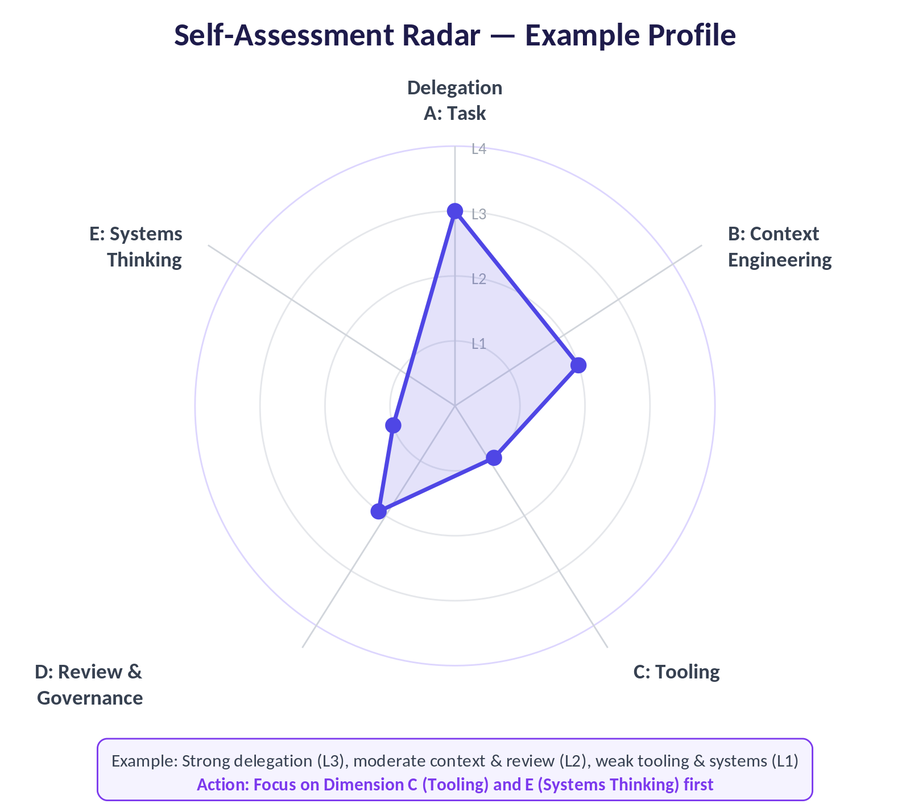

# From Prompting to Orchestration: A Developer's Field Guide to Agentic Coding

## Part 2: The Progression Guide

*Self-Assessment · Level Diagnosis · Step-by-Step Roadmap*

*Leon Hailstones | March 2026*

---

## How to Use This Guide

This guide is structured in three parts. Work through them in order.

| Part | What You Will Do | Output |
|------|-----------------|--------|
| Part 1 — Self-Assessment | Answer 20 diagnostic questions across 5 dimensions of your current practice | A clear level score (1–4) per dimension and overall |
| Part 2 — Level Profiles | Read the detailed profile for your current level | A clear picture of where you genuinely are today |
| Part 3 — Progression Roadmaps | Follow the step-by-step plan to move from your current level to the next | A concrete action list with timelines and checkpoints |

> **HONEST NOTE:** The biggest mistake engineers make is self-assessing too high. Read each level description carefully before scoring. Being accurately at Level 1 is far more valuable than wishfully placing yourself at Level 3.

---

## Part 1 — Self-Assessment

Score yourself on each of the 20 questions below. For each row, identify which column most accurately describes your current, everyday behaviour — not your aspirations or occasional experiments.

> **SCORING:** Level 1 = 1 point | Level 2 = 2 points | Level 3 = 3 points | Level 4 = 4 points. For each dimension, total your scores across 4 questions. Max per dimension = 16. Your overall level = average across all 5 dimensions.

### Dimension A: Task Delegation

This dimension measures how much work you are willing and able to hand off to an agent, and how complex those tasks are.

| Question / Behaviour | Level 1 | Level 2 | Level 3 | Level 4 |
|---------------------|---------|---------|---------|---------|
| A1. What is the most complex task you regularly hand off to an agent? | Single functions, snippets, quick regex | Multi-file refactors, test suites, single-service work | Full feature from spec to PR, including tests and docs | End-to-end workflows spanning multiple services and days |
| A2. How do you react when an agent makes an unexpected decision? | Restart the session and re-prompt more tightly | Review the diff and correct the specific error | Analyse why the context was insufficient and fix the harness | Review the orchestration design and add a guardrail or constraint |
| A3. What percentage of your daily coding work involves agents? | Under 20% — mostly manual with occasional AI queries | 20–50% — agents for discrete scoped tasks | 50–80% — agents handle most implementation; I review | 80%+ — I primarily design, specify, govern, and review |
| A4. How do you handle tasks that are 'too risky to delegate'? | Almost everything feels too risky; I do it myself | I delegate low-stakes work only; everything important stays manual | I delegate widely with approval gates for risky actions | Risk is managed by the harness; I define thresholds, not tasks |

*Dimension A score: _____ / 16 → My Level: _____*

### Dimension B: Context & Prompt Engineering

This dimension measures how deliberately and skillfully you shape what the agent sees and how you communicate with it.

| Question / Behaviour | Level 1 | Level 2 | Level 3 | Level 4 |
|---------------------|---------|---------|---------|---------|
| B1. How do you write prompts for agents? | Describe what I want in plain sentences, iterate if it fails | Include context, constraints, and expected output format | Write structured specs with success criteria the agent can verify itself | Author system-level harness prompts, injected context, and objective files that persist across sessions |
| B2. Do you have a CLAUDE.md or AGENTS.md for your main project? | No — I provide context ad hoc in each session | Yes — a basic one with project overview and key commands | Yes — well-crafted under 200 lines, Why/What/How structure, with progressive disclosure | Yes — plus per-directory overrides, agent-guide files, and automated context injection via hooks |
| B3. How do you manage context window limits during long sessions? | I am not aware when context fills up; sessions just get worse | I start new sessions when things go wrong | I compact proactively at ~50% fill and inject objectives into long runs | I architect multi-context workflows with progress files and initialiser agents that set up each new window |
| B4. How do you handle agent mistakes or hallucinations? | Re-run with a better prompt and hope for the best | Identify the prompt issue and fix it | Treat it as a harness signal: add a rule, constraint, or example to prevent recurrence | Root-cause the context failure and update the harness systematically — same mistake never happens twice |

*Dimension B score: _____ / 16 → My Level: _____*

### Dimension C: Tooling & Harness Configuration

This dimension measures how much you have invested in the infrastructure around your agents.

| Question / Behaviour | Level 1 | Level 2 | Level 3 | Level 4 |
|---------------------|---------|---------|---------|---------|
| C1. What harness components have you configured for your main project? | None — I use the agent out of the box | Basic IDE plugin with default settings; maybe one MCP server (GitHub) | CLAUDE.md, 2+ MCP servers, at least one custom skill, one subagent | Full harness: CLAUDE.md, skills library, MCP suite, subagents, hooks, slash commands, and a progress-tracking mechanism |
| C2. How do you extend your agent's capabilities beyond file I/O? | I don't — the agent uses bash and that's enough | I use one or two MCP servers from the marketplace | I use multiple MCP servers and have written a narrow CLI wrapper for at least one service | I design custom tools and MCP server integrations specifically for my team's workflow |
| C3. How do you use skills in your workflow? | I don't use skills yet | I use a pre-built skill | I have authored at least one custom skill that encodes my team's domain knowledge | I maintain a skills library with 5+ custom skills, each with bundled scripts and progressive disclosure |
| C4. How do you handle repetitive multi-step agent workflows? | I re-type the instructions each time | I copy-paste from a notes file | I have slash commands that encode my common workflows | I have a command/agent/skill pattern: slash commands invoke agents that use skills — fully automated pipelines |

*Dimension C score: _____ / 16 → My Level: _____*

### Dimension D: Review & Quality Governance

This dimension measures how rigorously and systematically you review agent output.

| Question / Behaviour | Level 1 | Level 2 | Level 3 | Level 4 |
|---------------------|---------|---------|---------|---------|
| D1. How do you review agent-generated code? | I accept it if it looks roughly right and the tests pass | I read through the diff and check for obvious issues | I review with the same rigour as a senior PR review | I have automated review gates that run before I ever see the output |
| D2. How do you track the quality impact of agentic workflows over time? | I don't track it | I informally keep note of recurring issues | I track metrics: bug rate, time-to-feature, test coverage changes | I have dashboards and quality gates that automatically flag when agent output quality degrades |
| D3. When an agent's PR gets a comment from a colleague, what do you do? | Fix the issue and move on | Fix it and mentally note the pattern | Fix it, add the missing context to CLAUDE.md or a skill, and verify the agent won't repeat it | Fix it, update the harness, and verify the fix by rerunning the scenario automatically |
| D4. What governance measures do you have for agent actions that touch production? | None — I review the output manually before deploying | Manual approval step in the deployment pipeline | Defined approval gates for risky actions | Full governance framework: approval gates, audit trails, automated security scanning, anomaly detection |

*Dimension D score: _____ / 16 → My Level: _____*

### Dimension E: Architectural & Systems Thinking

This dimension measures how far your thinking has evolved from writing individual features to designing the systems that build them.

| Question / Behaviour | Level 1 | Level 2 | Level 3 | Level 4 |
|---------------------|---------|---------|---------|---------|
| E1. When starting a new feature, what is your first instinct? | Open my editor and start writing code | Ask the AI to help write the code, reviewing as it goes | Write a spec first, then hand it to an agent with clear criteria | Design the workflow: which agents handle which parts, handoffs, success criteria at each stage |
| E2. How do you think about multi-agent systems? | I am not using multiple agents yet | I occasionally use two agents sequentially | I design parallel agent workflows for specific tasks | I design full orchestration architectures: orchestrator, specialists, error recovery, governance |
| E3. How familiar are you with MCP and A2A protocols? | I have heard of them but haven't used them | I use MCP servers via a plugin marketplace | I understand MCP well enough to build a custom server; I understand A2A | I design systems around both protocols |
| E4. How do you approach AI governance and risk in your team? | I don't think about it formally yet | I follow best practices informally | I have defined team-level guidelines | I maintain a governance framework: documented risk tiers, approval policies, audit logs, regular reviews |

*Dimension E score: _____ / 16 → My Level: _____*

### Scoring & Interpretation

Once you have scored all five dimensions, calculate your overall level.

| Dimension | Your Score (/16) | Your Level |
|-----------|-----------------|------------|
| A — Task Delegation | | |
| B — Context & Prompt Engineering | | |
| C — Tooling & Harness Configuration | | |
| D — Review & Quality Governance | | |
| E — Architectural & Systems Thinking | | |
| **TOTAL** | **_____ / 80** | |

| Total Score Range | Overall Level | What it means |
|------------------|---------------|---------------|
| 20–34 | Level 1 — Assistance | You use AI as a reactive tool. Real gains require moving to repo-aware, multi-step work. |
| 35–49 | Level 2 — Augmentation | You are getting real productivity gains on scoped tasks. Next jump: building a harness and delegating full features. |
| 50–64 | Level 3 — Delegation | You have a functioning harness. The gap to Level 4 is orchestration design and autonomous pipelines. |
| 65–80 | Level 4 — Autonomy | You design systems that build software. Your value is in architecture, governance, and orchestration. |

> **UNEVEN PROFILES:** Most developers score unevenly across dimensions. A common pattern is: high on A (delegation) but low on C (harness config) — which explains why agents give inconsistent results. Focus your progression energy on your lowest-scoring dimension first.

---

## Part 2 — Level Profiles

Read the profile that matches your current overall level.

### Level 1 Profile — The Prompted Developer

You use AI as a smarter search engine and boilerplate generator.

**What your day looks like:**
- You open a chat or IDE plugin when you need a specific thing
- You review the output, accept it if it looks right, and move on
- Each interaction is independent — you start fresh each time
- You feel comfortable with AI for low-stakes work but hesitant about anything important

**Your genuine strengths:**
- Strong code-reading skills — you critically review everything
- Not accumulating hidden technical debt from blindly accepting AI output
- You understand your codebase well because you write most of it yourself

**What is holding you back:**
- You are leaving 80% of the productivity gains on the table
- You re-type the same context every session
- You do not yet trust agents for multi-file work

> **THE UNLOCK:** The jump from Level 1 to 2 is not about trust — it is about context. Once you give the agent your project's structure, conventions, and toolchain in a CLAUDE.md, multi-file work becomes reliable and the fear of delegation shrinks fast.

### Level 2 Profile — The Augmented Developer

You have crossed the threshold into repo-aware AI work.

**What your day looks like:**
- You give agents tasks with meaningful scope
- You have a CLAUDE.md that your agent reads automatically
- You use an IDE-integrated agent and are comfortable with multi-file diffs
- You have connected one or two MCP servers

**Your genuine strengths:**
- Real multiplier on productivity for scoped, well-defined work
- You know how to write a prompt that gets usable results
- Right level of scepticism about AI output

**What is holding you back:**
- You can delegate tasks but not workflows
- You don't have skills, subagents, or hooks
- You are still the bottleneck

> **THE UNLOCK:** The jump from Level 2 to 3 is about building a harness that encodes your team's workflows. Once a skill knows how to run your tests, a subagent knows how to review security, and a hook automatically runs your formatter — you stop being the bottleneck.

### Level 3 Profile — The Delegating Developer

You hand off complete features to agents.

**What your day looks like:**
- You write a spec, hand it to an agent, and review a complete PR hours later
- You run parallel workstreams
- You have a skill library that agents select from automatically
- You have subagents for security review, documentation, and QA
- You compact aggressively and use progress files

**Your genuine strengths:**
- Dramatically higher output than peers at Level 2
- Reliable harness: same mistake doesn't happen twice
- Strong intuition for what to trust

**What is holding you back:**
- Agents don't work well across multiple context windows
- Your harness isn't yet replicable across the team
- You don't yet design orchestration architectures

> **THE UNLOCK:** The jump from Level 3 to 4 is an architectural shift. You stop configuring individual agents and start designing the systems that coordinate them.

### Level 4 Profile — The Orchestrating Engineer

You design systems that build software.

**What your day looks like:**
- You define business objectives and success criteria — agents determine implementation
- You design orchestration architectures
- You maintain a governance framework
- Scheduled maintenance agents run automatically
- You contribute to or build MCP servers and tooling

**Your genuine strengths:**
- You maintain systems that previously required entire teams — 10x+ leverage
- Your agents mechanically understand quality, security, and architectural standards
- You think in systems, not tasks

**What to watch for:**
- Harness over-engineering: spending more time optimising agent setup than shipping code
- Context invisibility: harder to know what context agents are actually using as systems grow
- Security surface expansion: more autonomy = more attack surface

---

## Part 3 — Progression Roadmaps

Each roadmap is a concrete, sequenced action plan. Do not skip ahead.

> **PRINCIPLE:** The most effective progression happens when you apply each step to real work — not toy projects.

### Roadmap: Level 1 → Level 2

**Timeline: 2–4 weeks.** The goal is to go from reactive prompting to confident, repo-aware task delegation.

#### Phase 1: Establish your foundation (Days 1–5)

**Step 1: Install a proper agentic tool.** If you only have Copilot autocomplete, this is your first move. Install Cursor (recommended for beginners) or Claude Code (recommended for terminal-comfortable developers).

**Step 2: Write your first CLAUDE.md.** Create a CLAUDE.md in the root of your primary project. Keep it under 100 lines. Include three sections: Why (what this project does), What (directory map), How (always-apply rules).

**Step 3: Connect GitHub as an MCP server.** Install the GitHub MCP server. Let the agent read issues directly.

#### Phase 2: Build delegation confidence (Days 6–14)

**Step 4: Delegate your first multi-file task.** Pick a well-scoped task: a refactor touching 3–5 files, a test suite for a module, or updating deprecated API usages. Write clear success criteria.

**Step 5: Conduct your first structured diff review.** Review with a checklist: logic matches spec? Security concerns? Follows patterns? Edge cases handled?

**Step 6: Iterate on your CLAUDE.md from PR feedback.** For every mistake, add one rule to CLAUDE.md.

#### Phase 3: Expand scope (Days 15–28)

**Step 7: Delegate a full feature end-to-end.** Write a one-page spec with context, requirements, constraints, and acceptance criteria.

**Step 8: Add a second MCP server.** Think about where the agent is flying blind.

**Level 2 Checkpoint — You are ready to progress when:**
- You can delegate a multi-file task and get a usable PR with minimal back-and-forth
- Your CLAUDE.md is written, in version control, and actively prevents common mistakes
- You have at least two MCP servers connected
- You review agent PRs with a consistent process
- You can explain what the agent's context window contains

### Roadmap: Level 2 → Level 3

**Timeline: 3–6 weeks.** Build a real harness — skills, subagents, hooks.

#### Phase 1: Build your first skill (Week 1)

**Step 1: Identify a workflow worth encoding.** Look for something you explain to the agent repeatedly.

**Step 2: Create your first SKILL.md.** Create a .claude/skills/[skill-name]/ directory. Write SKILL.md with YAML frontmatter.

**Step 3: Test the skill on a real task and refine.**

#### Phase 2: Create your first subagent (Week 2)

**Step 4: Define a security-reviewer subagent.** Create .claude/agents/security-reviewer.md.

**Step 5: Use the subagent on your next PR.**

**Step 6: Define a test-writer subagent.**

#### Phase 3: Automate with hooks and slash commands (Weeks 3–4)

**Step 7: Set up your first Stop hook.** Configure it to surface only failures.

**Step 8: Create a /pr-review slash command.**

**Step 9: Run your first parallel workstream.** Use two agents simultaneously.

#### Phase 4: Master context engineering (Weeks 5–6)

**Step 10: Implement the progress-file pattern for long tasks.**

**Step 11: Audit your CLAUDE.md against context engineering principles.** Remove anything that belongs in skills. Ensure progressive disclosure.

**Level 3 Checkpoint — You are ready to progress when:**
- You have at least 3 custom skills that agents invoke automatically
- You have at least 2 subagents running automatically
- You have a Stop hook that surfaces only failures
- You can hand off a full feature and receive a complete, reviewed PR with zero manual intervention
- You run at least 2 parallel agent workstreams routinely
- You have used the progress-file pattern successfully

### Roadmap: Level 3 → Level 4

**Timeline: 6–12 weeks.** This is the most significant mindset shift.

#### Phase 1: Learn orchestration architecture (Weeks 1–2)

**Step 1: Map your most complex recurring workflow.** Draw stages on paper.

**Step 2: Study MCP deeply.** Read the full specification. Build a minimal custom MCP server.

**Step 3: Design your first orchestrator agent.**

#### Phase 2: Build autonomous pipelines (Weeks 3–5)

**Step 4: Implement a fully automated feature pipeline.**

**Step 5: Add multi-context window support.**

**Step 6: Set up scheduled maintenance agents.** Documentation consistency nightly, dependency auditor weekly.

#### Phase 3: Build team-level governance (Weeks 6–8)

**Step 7: Document your risk tier framework.** Three tiers: autonomous, notify, block.

**Step 8: Implement approval gates for Tier 3 actions.**

**Step 9: Establish your quality metrics baseline.**

#### Phase 4: Share and multiply (Weeks 9–12)

**Step 10: Document your harness for the team.** Write an onboarding guide.

**Step 11: Run a team retrospective on agentic adoption.**

**Step 12: Contribute one skill or MCP server to the team.**

**Level 4 Checkpoint — You are operating at full autonomy when:**
- You have a fully automated pipeline from spec to PR
- You have a documented risk tier framework with working approval gates
- Scheduled maintenance agents run automatically
- You have built or deeply customised at least one MCP server
- You track quality metrics with baselines established
- Your harness is documented well enough for new team member onboarding
- You think in orchestration architectures first

---

## Common Traps at Each Level

| Level | Trap | Why it happens | How to escape |
|-------|------|---------------|---------------|
| 1 → 2 | Over-reviewing everything | Fear of AI mistakes leads to reviewing every line | Use automated linting and tests as your first pass |
| 1 → 2 | Under-investing in CLAUDE.md | "I'll just re-explain each time" | Spend 2 hours writing a good CLAUDE.md. It pays back within the first week. |
| 2 → 3 | Building skills before using agents enough | Premature optimisation | Delegate 20+ real tasks before writing your first skill |
| 2 → 3 | Context bloat from too many MCP servers | Installing every available MCP server | Install only what you use daily. Build narrow CLI wrappers. |
| 3 → 4 | Harness over-engineering | Spending more time on infrastructure than shipping | Timebox harness work: max 20% of a sprint |
| 3 → 4 | Skipping governance until it fails | Autonomy expands without guardrails | Define governance before you need it |
| 4 | Invisible context failures | Complex orchestration hides what context agents use | Add observability to your harness |
| All | Vibe coding regression | Delegating before establishing output works | Always define verifiable success criteria |

---

## Learning Resources by Level

| Level | Resource | Focus |
|-------|----------|-------|
| 1–2 | Claude Code Best Practices (code.claude.com/docs) | Core patterns: task delegation, CLAUDE.md, context management |
| 1–2 | Anthropic Prompt Engineering Guide (docs.anthropic.com) | Writing effective prompts for complex tasks |
| 2–3 | HumanLayer: Writing a Good CLAUDE.md (humanlayer.dev) | Context engineering principles |
| 2–3 | HumanLayer: Skill Issue — Harness Engineering (humanlayer.dev) | Practical harness configuration |
| 2–3 | Anthropic: Agent Skills Overview (platform.claude.com/docs) | How skills work, best practices |
| 3–4 | Anthropic Engineering: Effective Harnesses for Long-Running Agents | Multi-context window patterns |
| 3–4 | OpenAI: Harness Engineering (openai.com) | Real-world production harness |
| 3–4 | Matthew Groff: Implementing CLAUDE.md and Agent Skills (groff.dev) | End-to-end repo harness design |
| 3–4 | NxCode: Harness Engineering Complete Guide (nxcode.io) | Production harness patterns |
| 4 | MCP Specification (modelcontextprotocol.io) | Building custom MCP servers |
| 4 | LangGraph / CrewAI / AutoGen documentation | Multi-agent orchestration frameworks |
| 4 | Coder AI Maturity Self-Assessment (coder.com) | Organisational-level maturity benchmarking |
| All | Anthropic 2026 Agentic Coding Trends Report | Comprehensive landscape |

---

## Quick Reference — The Progression at a Glance

| | Level 1 | Level 2 | Level 3 | Level 4 |
|--|---------|---------|---------|---------|
| **Primary activity** | Prompting for specific outputs | Delegating scoped tasks | Handing off full features | Designing orchestration systems |
| **Agent relationship** | Reactive assistant | Capable collaborator | Autonomous executor | Coordinated workforce |
| **Context strategy** | Ad hoc, per-session | CLAUDE.md + basic MCP | Skills + subagents + hooks | Full harness + multi-context + governance |
| **Review approach** | Every line manually | Diff review as a PR | Automated gates + architectural review | Governance framework + metrics monitoring |
| **Task horizon** | Minutes | Hours (single task) | Hours to days (full feature) | Days to weeks (systems) |
| **Bottleneck** | Everything — AI waits for you | Task-level: you hand off individually | Session-level: parallel but you define each | Strategic: you define objectives, agents execute |
| **Key skill to develop** | Clear, precise prompting | CLAUDE.md + context engineering | Harness design + parallel orchestration | System architecture + governance design |
| **First action to take** | Install Cursor or Claude Code | Write your project's CLAUDE.md | Build your first skill + subagent | Map your first full orchestration pipeline |

The goal is not to reach Level 4 as fast as possible. It is to be accurately and consciously at each level — building the foundations that make the next level sustainable rather than fragile.

---

## Companion Document

This Progression Guide is Part 2 of a two-part series. **Part 1: The Research Briefing** covers the landscape of agentic coding in 2026 — the four-level maturity model, harness architecture, context engineering patterns, and the broader industry trends shaping how developers work with AI agents.

---

## AI Transparency Note

This document was co-authored by Leon Hailstones with the assistance of Claude (Anthropic). The research framework, editorial direction, and all factual claims were developed and verified by the human author. Claude contributed to drafting, structuring, fact-checking, diagram creation, and document formatting. All diagrams were generated programmatically using SVG and Python. This transparency note itself is part of our commitment to honest AI attribution — a practice we believe the developer community should normalise.
